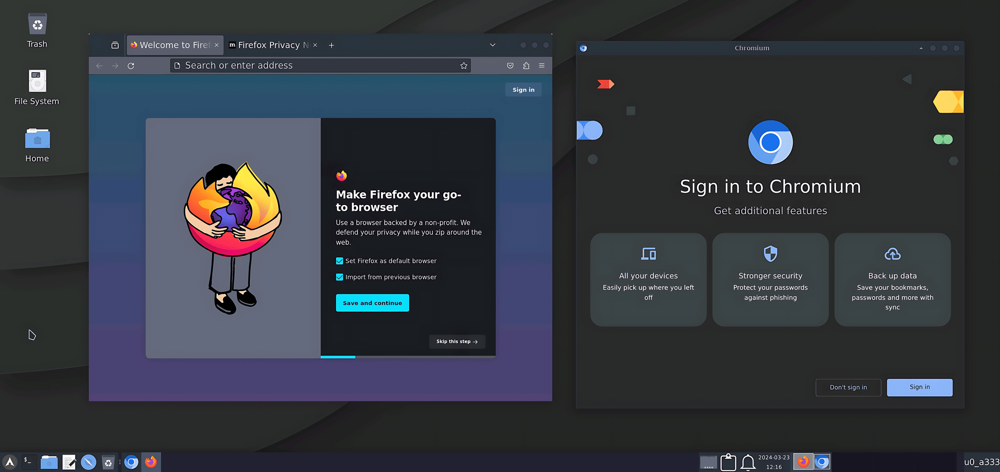
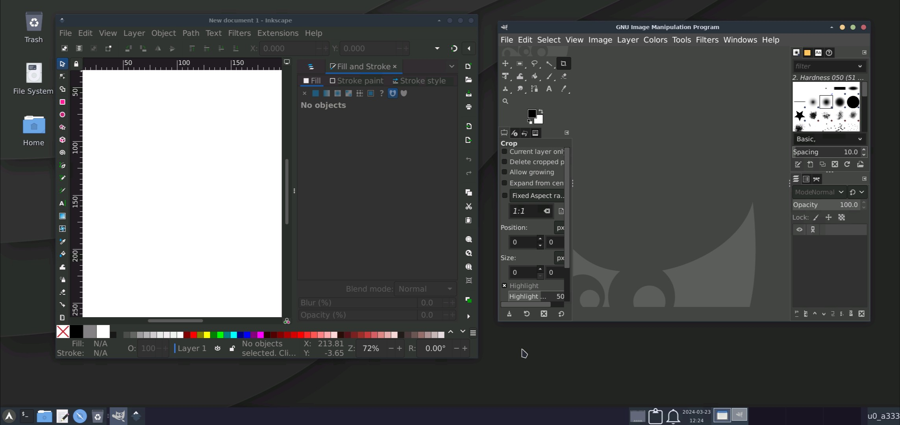
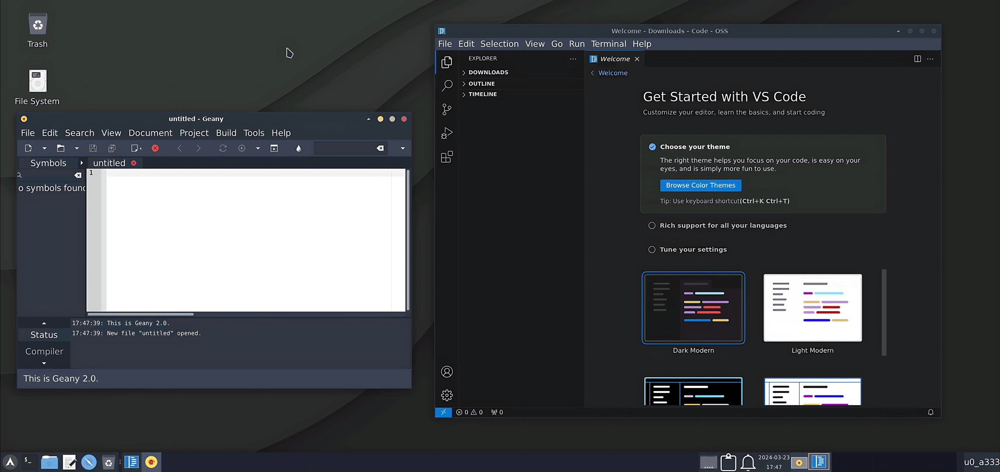
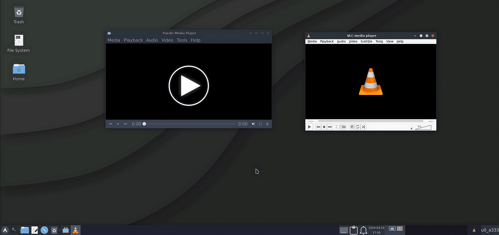
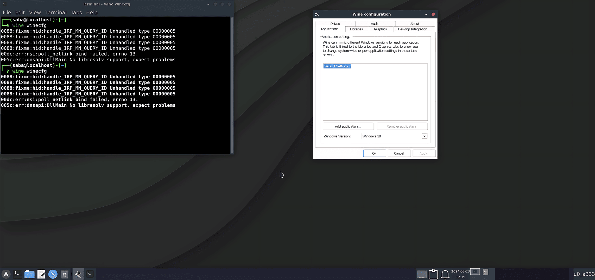
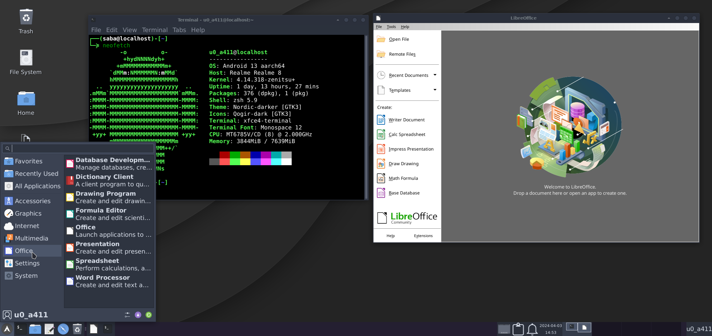
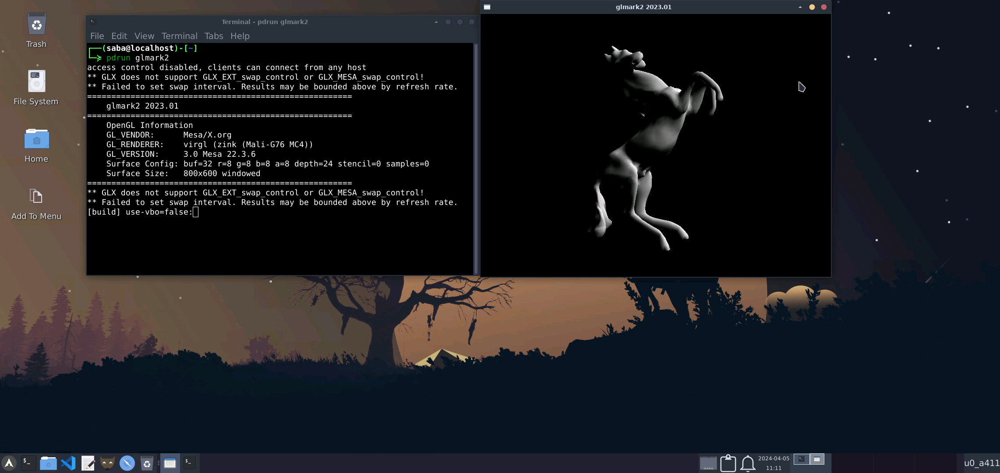

<br>
<center></center>
<br>
<p align="center"><b>Easily Install Termux Gui Desktop </b></p>
<p align="center"><b>With Some Popular Gui Apps Directly In Termux</b></p>

<div align="center">


</div>

## Features:

- :books: Easy To Setup
- :art: New Beautiful Theme And Styles
- :wine_glass: Wine To Run Windows Apps
- :mechanical_arm: Hardware Acceleration Enabled
- :paperclips: Termux:X11 Or Vnc For Gui Access
-  :jigsaw: One Click To Install Some useful Apps
   - :globe_with_meridians: Browser: Firefox Or Chromium
   - :man_technologist: Code Editor: VS Code Or Geany
   - :camera: Image Editor: Gimp Or Inkscape
   - :wine_glass: Wine To Run Windows Apps
- :link: And Much More...
<br>


## :warning: Check out them first :point_down:

### 1. Check Basic Requirment: [from here](#requirements)
### 2. Check All Avilable Desktop Styles: [from here](xfce_styles.md)
<a name="usage"></a>

### 3. Check About Hardware Acceleration : [from here](hw-acceleration.md)
### 4. Check About Distro Container: [from here](proot-caontainer.md)
### 5. Check Natively Supported Apps list: [from here](applist.md)
### 6. Installation: [from here](#installation)

<a name="requirements"></a>

## Minimum Requirements:
- No Root Required
- Android 7+ phone
- [Termux](https://termux.dev/en/) From [Github](https://github.com/termux/termux-app/releases) Or [Fdroid](https://f-droid.org/en/packages/com.termux/)
> Termux from Google Play is unmaintained due to API requirements So use the F-Droid one instead.
- 2GB of RAM 3GB of RAM
- 1.5 - 2 GB Of Internet
- 3 - 4 GB Of Free Storage
- VNC Client [RealVnc](https://play.google.com/store/apps/details?id=com.realvnc.viewer.android) Or [Nethunter Kex](https://store.nethunter.com/en/packages/com.offsec.nethunter.kex/)
- [Termux:X11](https://github.com/termux/termux-x11/releases)

<br>

## Basic Look:

<center></center>
<br>

# See Other Styles: [Here](xfce_styles.md)

## Screenshots:
> All gui apps screenshot

### Browsers:

<center></center>

### Image Editors:

<center></center>

### Code Editors:

<center></center>

### Media Players:

<center></center>

### Wine:

<center></center>

## See More Natively Supported Apps: [Here](applist.md)

## Want To Install More Apps (Like: Libreoffice) Which Are Not Avilable In Termux:

## Libre Office:

<center></center>

## See How To Use Distro Container: [Click Here](proot-caontainer.md)

## Hardware Acceleration In Distro Container And Also In Termux:

<center></center>


## Know More About Hardware Acceleration: [Here](hw-acceleration.md)

<br>
<br>

<a name="installation"></a>

# Installation:

>NOTE: This only works on Termux

>NOTE: A Fresh Desktop Install Is Always Best / Recommended

## Steps:

```
pkg update -y
```
```
pkg install wget -y
```
```
wget https://raw.githubusercontent.com/sabamdarif/termux-desktop/main/setup-termux-desktop
```
```
chmod +x setup-termux-desktop
```
```
./setup-termux-desktop
```
## One Line Install:

```
pkg update -y ; pkg install wget -y ; wget https://raw.githubusercontent.com/sabamdarif/termux-desktop/main/setup-termux-desktop ; chmod +x setup-termux-desktop ; ./setup-termux-desktop
```

## Usage:
- **Type `vncstart` OR `gui -start` to start vnc server.**
- **Type `vncstop` OR `gui -stop` to start vnc server.**
- **Type `gui -tx11` OR `tx11start` to star using Termux:11.**
- **Type `tx11stop` to stop Termux:11 server**
- **Type `vncstop -f` to kill vncserver**
- **Type `gui -kill` to kill both vncserver and Termux:x11 At Once**
## If you like my work then don't forget to give a Star :smile:
