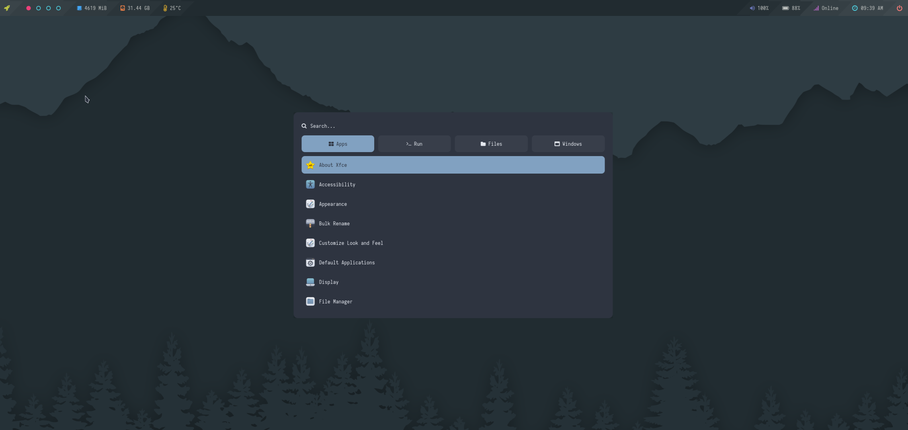
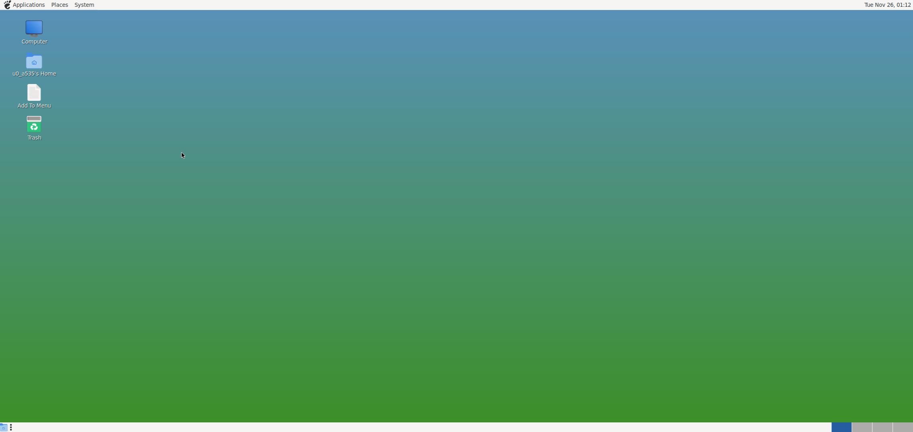

<br>
<center></center>
<br>
<p align="center"><b style ="font-size: x-large">Easily Install Termux Gui Desktop </b></p>

<div align="center">


</div>

## Features:

- :books: Easy To Setup
- :desktop_computer: XFCE, LXQt, and OPENBOX supported
- :art: New Beautiful Theme And Styles
- :wine_glass: Wine To Run Windows Apps _(x86_64 in arm64 device)_
- :mechanical_arm: Hardware Acceleration Enabled
- :paperclips: Termux:X11 / Vnc For Gui Access
- :package: Work with both APT , [PACMAN](https://youtu.be/ditNvG5Nxj0)
-  :jigsaw: One Click To Install Some useful Apps
   - :globe_with_meridians: Browser: Firefox / Chromium
   - :man_technologist: Code Editor: VS Code / Geany
   - :camera: Image Editor: Gimp / Inkscape
   - :link: More...
- :package: Install apps like libreoffice _(apps that are not avilable in termux by default)_
- :link: And Much More...

---

## :warning: Follow This Steps :point_down:

### 1. Check Basic Requirment: [from here](#requirements)
### 2. Check All Avilable Desktop Styles:

<b>

- [XFCE](xfce_styles.md)
- [LXQT](lxqt_styles.md)
- [OPENBOX](openbox_styles.md)
- [MATE](mate_styles.md)
>Openbox keybord shortcuts :- [Here](https://github.com/sabamdarif/termux-desktop/blob/main/see-more.md#hammer_and_wrenchopenbox-keybindings-cheat-sheet)
</b>

### 3. Check About Hardware Acceleration : [from here](https://github.com/sabamdarif/termux-desktop?tab=readme-ov-file#hardware-acceleration-in-distro-container-and-also-in-termux)
### 4. Check About Distro Container: [from here](https://github.com/sabamdarif/termux-desktop?tab=readme-ov-file#want-to-install-more-apps-like-libreoffice-which-are-not-avilable-in-termux) [[Video Tutorial](https://youtu.be/KiUTyGZ2grE)]
### 5. Check Natively Supported Apps list: [from here](applist.md)
### 6. Installation: [from here](#installation) [[Video Tutorial](https://youtu.be/SlR9f9hl5CQ)]
### 7. Uses: [from here](#uses)
### 8. See More: [from here](see-more.md)

---

<a name="requirements"></a>

## Minimum Requirements:
- No Root Required
- Android 8+ phone
- [Termux](https://termux.dev/en/) From [Github](https://github.com/termux/termux-app/releases) Or [Fdroid](https://f-droid.org/en/packages/com.termux/)
> Termux from Google Play can't poperly install x11-packages due to API limitation, so instead use the F-Droid Or Github build.
- 2GB of RAM 3GB of RAM
- 1.5 - 2 GB Of Internet
- 3 - 4 GB Of Free Storage
- VNC Client [RealVnc](https://play.google.com/store/apps/details?id=com.realvnc.viewer.android) Or [Nethunter Kex](https://store.nethunter.com/en/packages/com.offsec.nethunter.kex/)
- [Termux:X11](https://github.com/termux/termux-x11/releases)
- [Termux-API](https://github.com/termux/termux-api/releases) _(For Openbox only)_

---
<details>
<summary><b style ="font-size: large">Desktop Style's Screenshots: </summary>
</b>

#### XFCE:

<center></center>

#### LXQT:

<center></center>

#### OPENBOX:

<center></center>

### MATE:

<center></center>

</details>

### See All Desktop And Their Avilable Styles:

<b>

- [XFCE](xfce_styles.md)
- [LXQT](lxqt_styles.md)
- [OPENBOX](openbox_styles.md)
- [MATE](mate_styles.md)
</b>

---

## Screenshots:
> All gui apps screenshot

### Browsers:

<center></center>

### Image Editors:

<center></center>

### Code Editors:

<center></center>

### Media Players:

<center></center>

## See More Natively Supported Apps: [Here](applist.md)

---

### Wine: [See More](https://github.com/sabamdarif/termux-desktop/blob/main/wine.md#about-wine)

<center></center>

---

## Want To Install More Apps (Like: Libreoffice) Which Are Not Avilable In Termux:

### See How To Use Distro Container: [Click Here](proot-caontainer.md)

#### Libre Office:

<center></center>

---

## Hardware Acceleration In Distro Container And Also In Termux:

<center></center>


## Know More About Hardware Acceleration: [Here](hw-acceleration.md)

---
## :warning: About The New The Experimental GPU Drivers (mesa-vulkan-icd-wrapper)

<b>

The experimental drivers only support a few GPUs and currently use Vulkan only (But opengl will be enabled using another way)

In my tests, I achieved 1000+ FPS in vkmark on all my devices. I tried it on an Adreno 619 (best everything work fine), Adreno 750 (usable but some apps don't launch), Adreno 720 (good overall but with few issues), and Mali G76 (similar issue like Adreno 720).

Also if you have Adreno GPU then please select ubuntu or debian as distro container so it can use ternip in the distro container.
Sadly for other then adreno, GPU might not work on the distro container.

If you type 'n/N' then it will use the old way to setup Hardware Acceleration.
</b>

---

<a name="installation"></a>

# Installation:

>NOTE: This Only Works On Termux From Github Or Fdroid

>NOTE: A Fresh Install Is Always Recommended


```bash
curl -Lf https://raw.githubusercontent.com/sabamdarif/termux-desktop/main/setup-termux-desktop -o setup-termux-desktop && chmod +x setup-termux-desktop && ./setup-termux-desktop
```

---

## :warning:If you are in android 12 or higher then first disable `Phantom Process Killer`
### Guide:- [Here](https://github.com/atamshkai/Phantom-Process-Killer)

---

<a name="uses"></a>

## Uses:

### Command:- `tx11start`
- `tx11start` *to star Termux:11 with gpu acceleration*
- `tx11start --nogpu` *to star Termux:11 without gpu acceleration*
- `tx11start --nogpu --legacy` *to star Termux:11 without gpu acceleration and _-legacy-drawing_*
- `tx11start --nodbus` *to star Termux:11 without dbus*
- `tx11start --nodbus --nogpu` *to star Termux:11 without gpu acceleration and dbus*
- `tx11start --nodbus --nogpu --legacy` *to star Termux:11 without gpu acceleration and dbus and with _-legacy-drawing_*
- `tx11start --nodbus --legacy` *to star Termux:11 without dbus and use _-legacy-drawing_ (nodbus and gpu)*
- `tx11start --legacy` *to star Termux:11 with _-legacy-drawing_ (with dbus and gpu)*
- `tx11start --debug --OTHER-PARAMETERS` *To see log of that commmand*
>tx11start --debug --nogpu *To See --nogpu's log*

### Command:- `tx11stop`
- `tx11stop` *to stop Termux:11*
- `tx11stop -f` *to kill Termux:11*

### Command:- `vncstart`
- `vncstart` *to start vncserver*
- `vncstart ---nogpu` *to start vncserver without gpu acceleration*
### Command:- `vncstop`
- `vncstop` *to stop vncserver*
- `vncstop -f` *to kill vncserver*

### Command:- `gui`
#### If you select only one of them to access gui
- `gui --start / gui -l` *to start Termux gui*
- `gui --stop / gui -s` *to stop gui*

#### If you select both for gui access
- `gui -l / --start` `vnc` *to start VNC*
- `gui -l / --start` `tx11` *to start Termux:X11*
- `gui -s / --stop` `vnc` *to stop VNC*
- `gui -s / --stop` `tx11` *to stop Termux:X11*
- `gui -k / --kill / -kill` *to kill both vncserver and Termux:x11 At Once*
<br>

### Command:- `setup-termux-desktop`
- `setup-termux-desktop --change style` *To Change Desktop Style*
- `setup-termux-desktop --change hw` *To Change Hardware Acceleration Method*
- `setup-termux-desktop --change pd` *To Change Installed Proot-Distro*
- `setup-termux-desktop --change autostart` *To change autostart behaviour*
<br>

- `setup-termux-desktop --reinstall icons / themes /config` *To Reinstall Icons / Themes / Config*
- `setup-termux-desktop --reinstall icons,themes,..etc` *To Reinstall Them At Once*
<br>

- `setup-termux-desktop --reset` *To Reset All Changes Made By This Script Without Uninstalling The Packages*
<br>

- `setup-termux-desktop --remove / -r` *To Remove Termux Desktop*
<br>

- `setup-termux-desktop --debug` **(At The Start)** *To generate a log file for any of the above command*

  - `setup-termux-desktop --debug --install` *To create a log of whole installation process*

---

### Join in chat

<a href="https://t.me/hello_android_0">

</a>

---

## If you like my work then don't forget to give a Star :blush:
