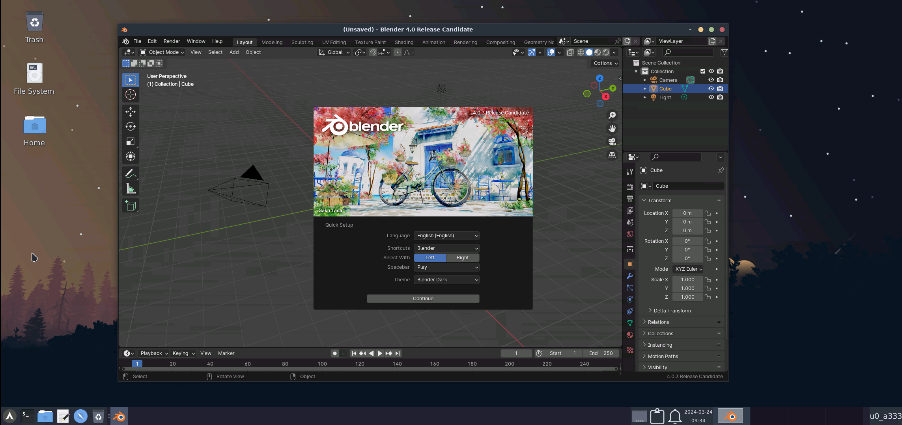
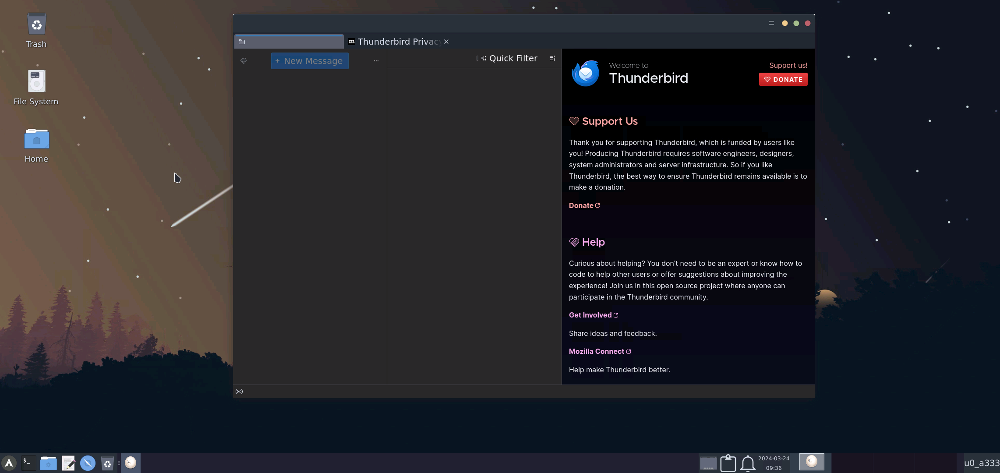
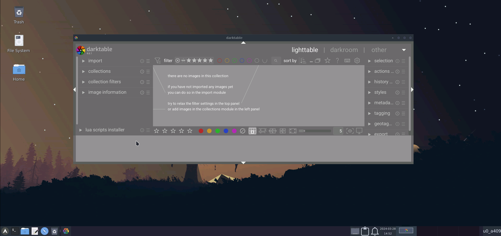
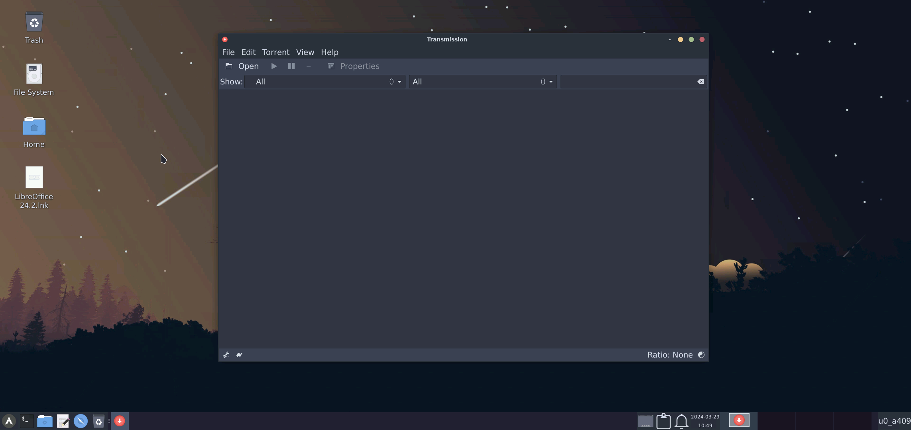

## More Natively Working Apps:

>Most of the apps are available in tur(termux user repo)

### Audacity:

> pkg install audacity -y

### Blender:

> pkg install blender -y

### Thunderbird (mail client):

> pkg install thunderbird -y

### Handbrake (video compressor):

> pkg install handbrake -y

### Darktable (RAW Image Editor):

> pkg install darktable -y

### Transmission (Bittorrent Client):

> pkg install transmission-gtk -y

