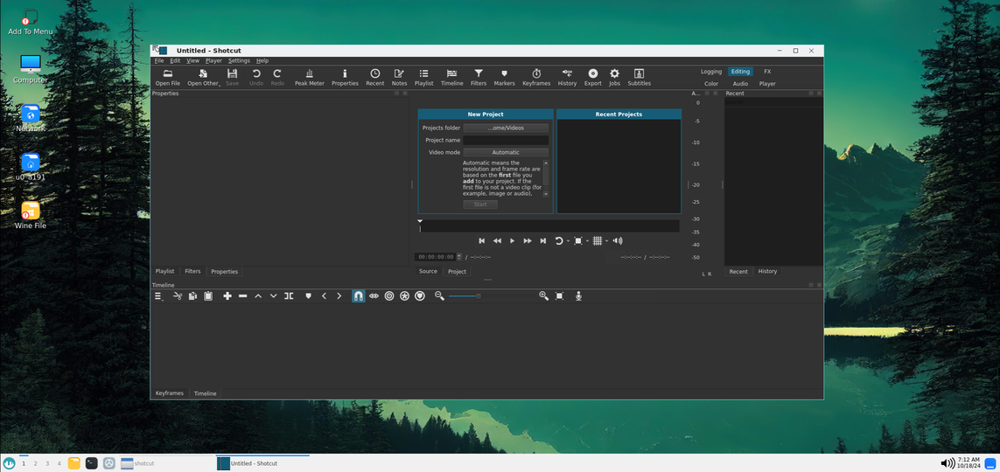
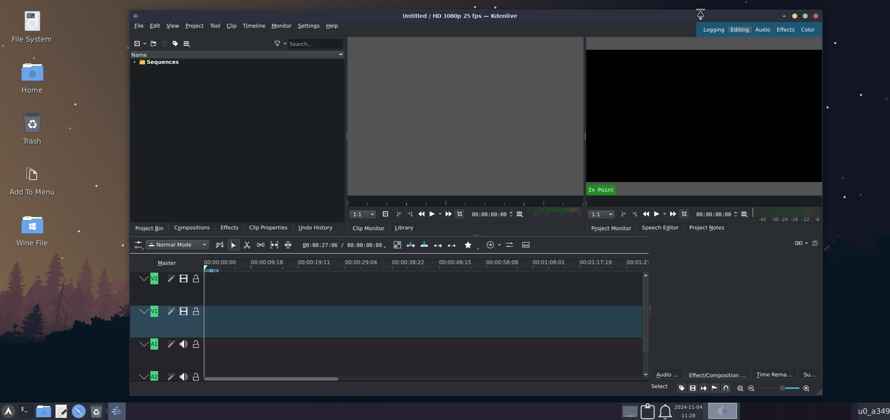
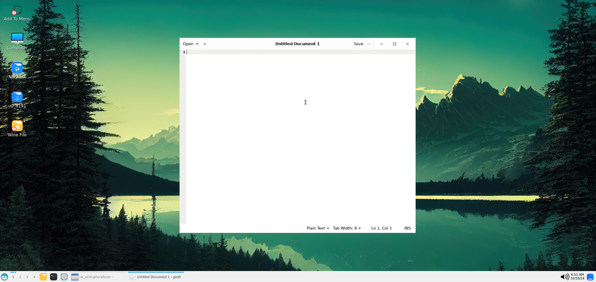
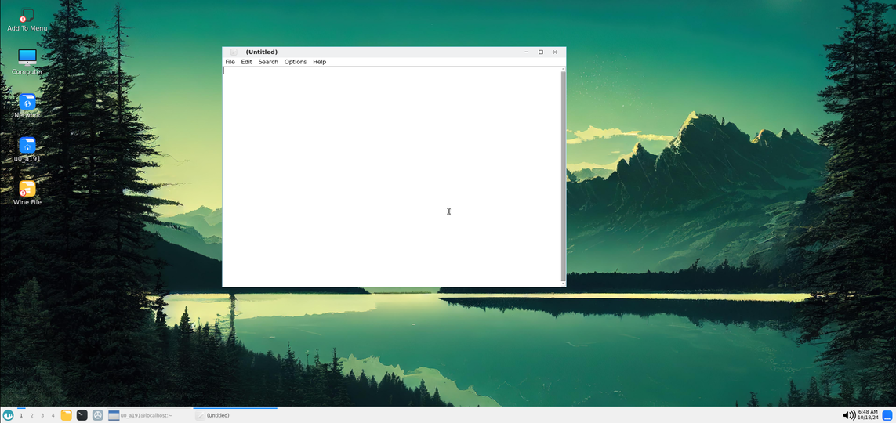
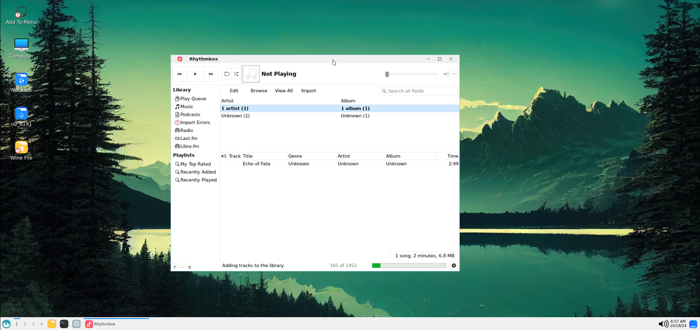
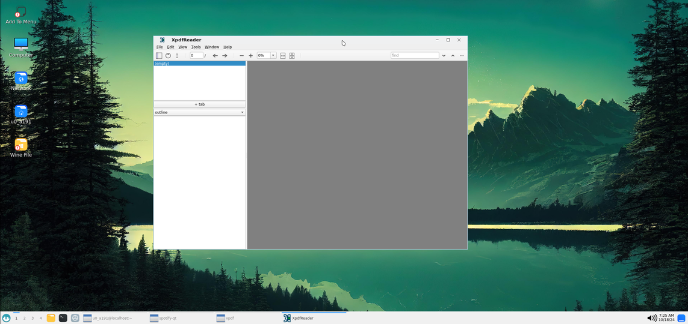

## Natively Working Apps:

> Many additional applications are available for Termux via the **tur (Termux User Repository)** or the **x11 repository**.

### Browsers:


### Image Editors:


### Code Editors:


### Media Players:


---

### Audio and Video Editing Tools

#### Audacity (Audio Editor)
Audacity is a versatile audio editing tool for recording, editing, and mastering audio files.
```bash
pkg install audacity -y
```
<div style="text-align: center;">
  
</div>

#### Blender (3D Modeling and Animation)
Blender is a comprehensive tool for 3D modeling, animation, and rendering.
```bash
pkg install blender -y
```
<div style="text-align: center;">
  
</div>

#### Handbrake (Video Compressor)
Handbrake is an open-source tool for compressing and converting video files.
```bash
pkg install handbrake -y
```
<div style="text-align: center;">
  
</div>

#### Shotcut (Video Editor)
Shotcut is a feature-rich video editor supporting various formats and advanced editing features.
```bash
pkg install shotcut jack jack2 jack-example-tools -y
```
<div style="text-align: center;">
  
</div>

#### Kdenlive (Video Editor)
Kdenlive is a robust, open-source video editor suitable for professionals and beginners.
```bash
pkg install kdenlive -y
```
<div style="text-align: center;">
  
</div>

---

### Communication and Productivity Tools

#### Thunderbird (Email Client)
Thunderbird is a powerful and customizable email client.
```bash
pkg install thunderbird -y
```
<div style="text-align: center;">
  
</div>

#### Gedit (Text Editor)
Gedit is a simple yet powerful text editor with syntax highlighting.
```bash
pkg install gedit -y
```
<div style="text-align: center;">
  
</div>

#### Leafpad (Text Editor)
Leafpad is a lightweight text editor perfect for quick edits.
```bash
pkg install leafpad -y
```
<div style="text-align: center;">
  
</div>

---

### Multimedia and Internet Tools

#### Darktable (RAW Image Editor)
Darktable is an advanced tool for editing and managing RAW image files.
```bash
pkg install darktable -y
```
<div style="text-align: center;">
  
</div>

#### Transmission (Bittorrent Client)
Transmission is a lightweight and efficient torrent client.
```bash
pkg install transmission-gtk -y
```
<div style="text-align: center;">
  
</div>

#### Rhythmbox (Music Player)
Rhythmbox is a music management and playback application.
```bash
pkg install rhythmbox -y
```
<div style="text-align: center;">
  
</div>

#### Xpdf Reader
Xpdf is a lightweight PDF reader for viewing documents.
```bash
pkg install xpdf -y
```
<div style="text-align: center;">
  
</div>

#### Otter Browser (Web Browser)
Otter Browser is a lightweight browser designed with simplicity and efficiency in mind.
```bash
pkg install otter-browser -y
```

#### Netsurf (Web Browser)
Netsurf is a compact and resource-friendly web browser.
```bash
pkg install netsurf -y
```

---

### List Keep Growing ...