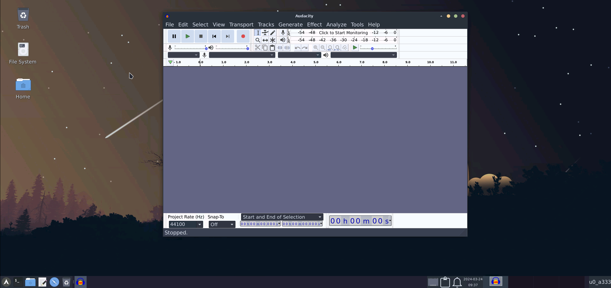
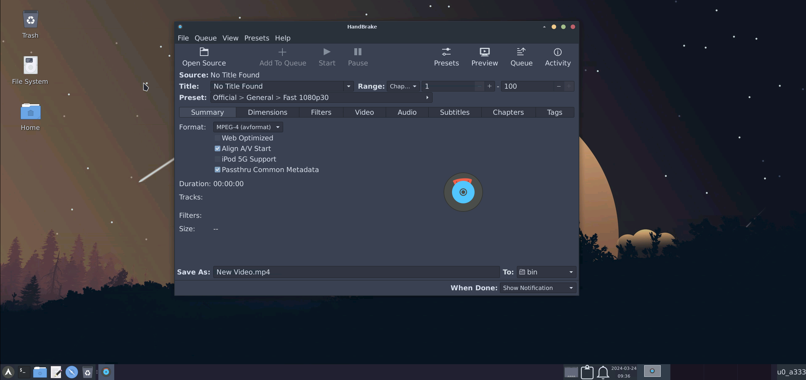

## More Natively Working Apps:

### Audacity:

> pkg install audacity -y

### Blender:

> pkg install blender -y

### Thunderbird (mail client):

> pkg install thunderbird -y

### Handbrake (video compressor):

> pkg install handbrake -y

