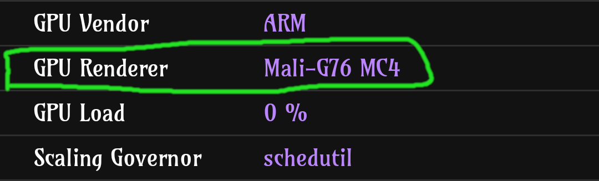
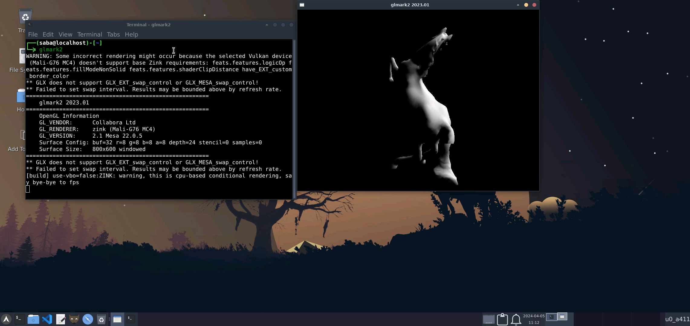

# Hardware Acceleration in Termux

- <b>When You Run The Installer Script Just Chose The Hardware Acceleration Method</b>
- <b>If You Type Yes For Distro Container Setup So You Need To Chose A Method For The Distro Too</b>
- <b>Then Everything Will Be Configured Automaticly</b>

### Use [Cpu Z](https://play.google.com/store/apps/details?id=com.cpuid.cpu_z&pcampaignid=web_share) To Know About Your GPU

<center></center>

<b>Search On Google About Your Gpu , Which Supprot Best With It virpipe or zink (you will probably find any reddit post about it)

### How To use Hardware Acceleration in Termux ?

- <b>Start Termux Desktop Using Vnc Or Termux:x11</b>(probably Best Way To Do That)
- <b>Run Any Program</b>

### How To use Hardware Acceleration in Proot Distro (Distro Container) ?

#### 1st Method
- <b>Launch Termux Desktop</b>
- <b>In Termux Terminal Just Run</b>
```
pdrun program
```
> By Default it run with gpu acceleration

```
pdrun --no--gpu program
```
> To run program without gpu acceleration

<center></center>

#### 2nd Method 
- <b>Add The Program To Termux Menu</b>
- <b>Run The Program From Termux Menu</b>

<br><br>

## Hardware Acceleration In Termux:

<center></center>

## How to Change Hardware Acceleration Method ?

- <b>Go To `$PREFIX/bin`</b>

- <b>type `nano / vim vncstart` and `nano / vim tx11start` and `nano / vim pdrun`</b>

- <b>Here You Find A Line Called `GALLIUM_DRIVER=`</b>

- <b>Change The Word After `=` with `zink / virpipe` Which You Want And Save It</b>

<br><br>

# Performance results:

#### If you want to use TURNIP you have to install the drivers for it in the proot-distro you installed

- <b>You will get the driver here:- [Reddit Post](https://www.reddit.com/r/termux/comments/19dpqas/proot_linux_only_dri3_patch_mesa_turnip_driver/)

- <b>The direct download link (arm64 DEB):- [Here](https://drive.google.com/file/d/1f4pLvjDFcBPhViXGIFoRE3Xc8HWoiqG-/view)
- ubuntu ppa :- [Here](https://github.com/MastaG/mesa-turnip-ppa)

- Latest Drivers:- https://github.com/K11MCH1/AdrenoToolsDrivers/releases
- Some More Links:-
  - https://github.com/Herick75/Pre-Compiled-Mesa-Turnip-Zink/releases/tag/Turnip-zink-stable
  - https://github.com/xDoge26/proot-setup/tree/main/Packages

### This Test Was Made By [DroidMaster](https://github.com/LinuxDroidMaster)

> Device used: Lenovo Legion Y700 2022 model (Snapdragon 870 - Adreno 650)

🔥[[Video -By DroidMaster] Hardware Acceleration Part 1 - What it is, how it is used (VIRGL AND ZINK)](https://www.youtube.com/watch?v=fgGOizUDQpY)   
🔥[[Video -By DroidMaster] Hardware Acceleration Part 2 - (VIRGL, ZINK, TURNIP) - how can you use them](https://youtu.be/07kq4RHbXrE?si=5ClDpIm8Kr3M0Y_D)


### GLMARK2 

> [!IMPORTANT]  
> The following tests were done in a proot distro environment with Debian and a XFCE4 desktop.

<table>
  <thead>
    <tr>
      <th scope="col" colspan="6">DEBIAN PROOT (GLMARK2 SCORE - the higher the number the better the performance)</th>
    </tr>
    <tr>
        <th scope="col">RUN</th>
        <th scope="col">LLVMPIPE</th>
        <th scope="col">VIRGL</th>
        <th scope="col">VIRGL ZINK</th>
        <th scope="col">TURNIP</th>
        <th scope="col">ZINK</th>
    </tr>
  </thead>

  <tbody>
    <tr>
      <td>1</td>
      <td>93</td>
      <td>70</td>
      <td>66</td>
      <td>198</td>
      <td>Error</td>
    </tr>
    <tr>
      <td>2</td>
      <td>93</td>
      <td>77</td>
      <td>66</td>
      <td>198</td>
      <td>Error</td>
    </tr>
    <tr>
      <td>3</td>
      <td>72</td>
      <td>70</td>
      <td>71</td>
      <td>198</td>
      <td>Error</td>
    </tr>
    <tr>
      <td>4</td>
      <td>94</td>
      <td>76</td>
      <td>66</td>
      <td>197</td>
      <td>Error</td>
    </tr>
    <tr>
      <td>5</td>
      <td>93</td>
      <td>75</td>
      <td>67</td>
      <td>198</td>
      <td>Error</td>
    </tr>
  </tbody>
  <tfoot>
    <tr>
      <th scope="row">Initialize server</th>
      <td>Not needed</td>
      <td><code>virgl_test_server_android &</td>
      <td><code>MESA_NO_ERROR=1 MESA_GL_VERSION_OVERRIDE=4.3COMPAT MESA_GLES_VERSION_OVERRIDE=3.2 GALLIUM_DRIVER=zink ZINK_DESCRIPTORS=lazy virgl_test_server --use-egl-surfaceless --use-gles &</code></td>
      <td>Not needed</td>
      <td><code>MESA_NO_ERROR=1 MESA_GL_VERSION_OVERRIDE=4.3COMPAT MESA_GLES_VERSION_OVERRIDE=3.2 GALLIUM_DRIVER=zink ZINK_DESCRIPTORS=lazy virgl_test_server --use-egl-surfaceless --use-gles &</code></td>
    </tr>
    <tr>
      <th scope="row">Command used</th>
      <td><code>glmkar2</td>
      <td><code>GALLIUM_DRIVER=virpipe MESA_GL_VERSION_OVERRIDE=4.0 glmark2</td>
      <td><code>GALLIUM_DRIVER=virpipe MESA_GL_VERSION_OVERRIDE=4.0 glmark2</td>
      <td><code>MESA_LOADER_DRIVER_OVERRIDE=zink TU_DEBUG=noconform glmark2</td>
      <td><code>GALLIUM_DRIVER=zink MESA_GL_VERSION_OVERRIDE=4.0 glmark2</td>
    </tr>
    <tr>
      <th scope="row">GLMARK GPU Info</th>
      <td>llvmpipe</td>
      <td>virgl (Adreno)</td>
      <td>virgl (zink Adreno)</td>
      <td>virgl (Turnip Adreno)</td>
      <td>zink (Adreno)</td>
    </tr>
  </tfoot>
</table>

---

> [!IMPORTANT]  
> The following tests were done in Termux (NOT in proot-distro) and a XFCE4 desktop.

<table>
  <thead>
    <tr>
      <th scope="col" colspan="6">TERMUX NO PROOT (GLMARK2 SCORE - the higher the number the better the performance)</th>
    </tr>
    <tr>
        <th scope="col">RUN</th>
        <th scope="col">LLVMPIPE</th>
        <th scope="col">VIRGL</th>
        <th scope="col">VIRGL ZINK</th>
        <th scope="col">ZINK</th>
        <th scope="col">TURNIP</th>
    </tr>
  </thead>

  <tbody>
    <tr>
      <td>1</td>
      <td>69</td>
      <td>Error</td>
      <td>92</td>
      <td>121</td>
      <td>Doesn't apply</td>
    </tr>
    <tr>
      <td>2</td>
      <td>70</td>
      <td>Error</td>
      <td>92</td>
      <td>122</td>
      <td>Doesn't apply</td>
    </tr>
    <tr>
      <td>3</td>
      <td>69</td>
      <td>Error</td>
      <td>93</td>
      <td>121</td>
      <td>Doesn't apply</td>
    </tr>
    <tr>
      <td>4</td>
      <td>69</td>
      <td>Error</td>
      <td>93</td>
      <td>124</td>
      <td>Doesn't apply</td>
    </tr>
    <tr>
      <td>5</td>
      <td>69</td>
      <td>Error</td>
      <td>93</td>
      <td>123</td>
      <td>Doesn't apply</td>
    </tr>
  </tbody>
  <tfoot>
    <tr>
      <th scope="row">Initialize server</th>
      <td>Not needed</td>
      <td><code>virgl_test_server_android &</td>
      <td><code>MESA_NO_ERROR=1 MESA_GL_VERSION_OVERRIDE=4.3COMPAT MESA_GLES_VERSION_OVERRIDE=3.2 GALLIUM_DRIVER=zink ZINK_DESCRIPTORS=lazy virgl_test_server --use-egl-surfaceless --use-gles &</code></td>
      <td><code>MESA_NO_ERROR=1 MESA_GL_VERSION_OVERRIDE=4.3COMPAT MESA_GLES_VERSION_OVERRIDE=3.2 GALLIUM_DRIVER=zink ZINK_DESCRIPTORS=lazy virgl_test_server --use-egl-surfaceless --use-gles &</code></td>
      <td>Doesn't apply</td>
    </tr>
    <tr>
      <th scope="row">Command used</th>
      <td><code>glmkar2</td>
      <td><code>GALLIUM_DRIVER=virpipe MESA_GL_VERSION_OVERRIDE=4.0 glmark2</td>
      <td><code>GALLIUM_DRIVER=virpipe MESA_GL_VERSION_OVERRIDE=4.0 glmark2</td>
      <td><code>GALLIUM_DRIVER=zink MESA_GL_VERSION_OVERRIDE=4.0 glmark2</td>
      <td>Doesn't apply</td>
    </tr>
    <tr>
      <th scope="row">GLMARK GPU Info</th>
      <td>llvmpipe</td>
      <td>virgl (Adreno)</td>
      <td>virgl (zink Adreno)</td>
      <td>zink (Adreno)</td>
      <td>Doesn't apply</td>
    </tr>
  </tfoot>
</table>


---
### [Firefox Aquarium WebGL Benchmark](https://webglsamples.org/aquarium/aquarium.html)

> [!NOTE]  
> You need to [enable WebGL in Firefox](https://tecnorobot.educa2.madrid.org/tecnologia/-/visor/configurar-webgl) to use the GPU

<table>
  <thead>
    <tr>
      <th scope="col" colspan="4">DEBIAN PROOT (FIREFOX-ESR WEBGL AQUARIUM FPS - the higher the number the better the performance)</th>
    </tr>
    <tr>
        <th scope="col">LLVMPIPE</th>
        <th scope="col">VIRGL</th>
        <th scope="col">VIRGL ZINK</th>
        <th scope="col">TURNIP</th>
    </tr>
  </thead>

  <tbody>
    <tr>
      <td>4</td>
      <td>20</td>
      <td>17</td>
      <td>Web page crash</td>
    </tr>
  </tbody>
</table>

<table>
  <thead>
    <tr>
      <th scope="col" colspan="5">TERMUX NOT PROOT (FIREFOX-ESR WEBGL AQUARIUM FPS - the higher the number the better the performance)</th>
    </tr>
    <tr>
        <th scope="col">LLVMPIPE</th>
        <th scope="col">VIRGL</th>
        <th scope="col">VIRGL ZINK</th>
        <th scope="col">ZINK</th>
        <th scope="col">TURNIP</th>
    </tr>
  </thead>

  <tbody>
    <tr>
      <td>2</td>
      <td>Error</td>
      <td>24</td>
      <td>40</td>
      <td>Doesn't apply</td>
    </tr>
  </tbody>
</table>


---
Other tests I did: 

* SuperTuxKart tested during 30 seconds
