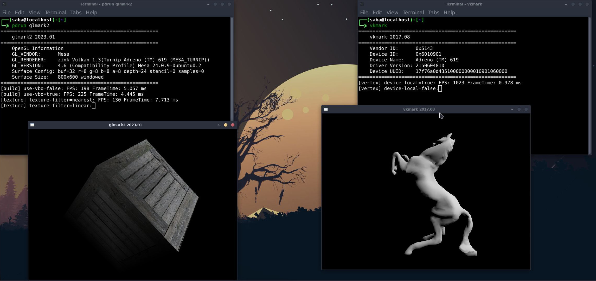
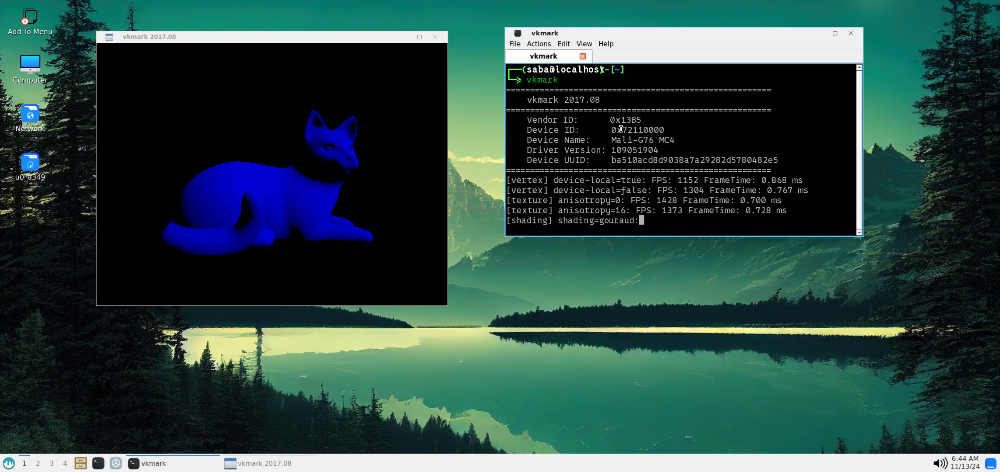

# :mechanical_arm: Hardware Acceleration in Termux

When setting up hardware acceleration in Termux, follow these steps for optimal configuration:

## Installation
- **Run the Installer Script:** Choose your preferred hardware acceleration method during the installation.
- **Distro Container Setup:** If you opt for a distro container, select the hardware acceleration method for the distro as well.
  >For Adreno GPU you don't nedd to chose, it will automatically use turnip if you use ubuntu/debian 
- **Automatic Configuration:** Once selected, everything will be configured automatically.

> Use [CPU-Z](https://play.google.com/store/apps/details?id=com.cpuid.cpu_z&pcampaignid=web_share) to identify your GPU. Research your GPU online to determine whether `virpipe` or `zink` works best; Reddit or similar forums often have useful insights.


## Using Hardware Acceleration in Termux
1. **Start Termux Desktop** via VNC or Termux:x11 (recommended).
2. **Run Your Programs** as needed.

## Using Hardware Acceleration in Proot Distro (Distro Container)

### Method 1: Terminal Commands
1. Launch Termux Desktop.
2. Run programs in Termux terminal:
   ```bash
   pdrun program
   ```
   - By default, this runs with GPU acceleration.
   ```bash
   pdrun --nogpu program
   ```
   - To run without GPU acceleration.


### Method 2: Termux Menu
1. Add the desired program to the Termux menu.
2. Launch the program directly from the Termux menu.

## Changing Hardware Acceleration Drivers

### Manual Configuration
1. **Install Required Packages.**
2. Navigate to `$PREFIX/bin` and edit the following files using `nano` or `vim`:
   - `vncstart`
   - `tx11start`
   - `pdrun`
3. Look for the line:
   ```bash
   GALLIUM_DRIVER=
   ```
   Replace the value after `=` with either `zink` or `virpipe` as desired.

### Automatic Configuration
Run the following command to change drivers:
```bash
setup-termux-desktop --change hw
```
> **Warning:** Sometime this may occasionally cause desktop break issues.

---

# :chart_with_upwards_trend: Performance Results

## Experimental Driver Performance

### Adreno with `mesa-vulkan-icd-wrapper` and Turnip


### Mali with `mesa-vulkan-icd-wrapper`


### Test Environment
> These tests and results were conducted by [LinuxDroidMaster](https://github.com/LinuxDroidMaster).

- **Device:** Lenovo Legion Y700 (Snapdragon 870, Adreno 650)
- **Distro:** Debian in Proot with XFCE4 Desktop
- **GLMark2**: Used to evaluate GPU performance.

### GLMark2 Scores: Proot Distro

| Run | LLVMPIPE | VIRGL | VIRGL ZINK | TURNIP | ZINK |
|-----|----------|-------|------------|--------|------|
| 1   | 93       | 70    | 66         | 198    | Error|
| 2   | 93       | 77    | 66         | 198    | Error|
| 3   | 72       | 70    | 71         | 198    | Error|
| 4   | 94       | 76    | 66         | 197    | Error|
| 5   | 93       | 75    | 67         | 198    | Error|

#### Commands Used:

| Driver        | Command                                      |
|---------------|----------------------------------------------|
| LLVMPIPE      | `glmark2`                                   |
| VIRGL         | `GALLIUM_DRIVER=virpipe MESA_GL_VERSION_OVERRIDE=4.0 glmark2` |
| VIRGL ZINK    | `GALLIUM_DRIVER=virpipe MESA_GL_VERSION_OVERRIDE=4.0 glmark2` |
| TURNIP        | `MESA_LOADER_DRIVER_OVERRIDE=zink TU_DEBUG=noconform glmark2` |
| ZINK          | `GALLIUM_DRIVER=zink MESA_GL_VERSION_OVERRIDE=4.0 glmark2`   |

---

### GLMark2 Scores: Termux (No Proot)

| Run | LLVMPIPE | VIRGL | VIRGL ZINK | ZINK | TURNIP |
|-----|----------|-------|------------|------|--------|
| 1   | 69       | Error | 92         | 121  | N/A    |
| 2   | 70       | Error | 92         | 122  | N/A    |
| 3   | 69       | Error | 93         | 121  | N/A    |
| 4   | 69       | Error | 93         | 124  | N/A    |
| 5   | 69       | Error | 93         | 123  | N/A    |

---

### Firefox Aquarium WebGL Benchmark

#### Proot Distro Results (Firefox-ESR WebGL Aquarium FPS)
| LLVMPIPE | VIRGL | VIRGL ZINK | TURNIP        |
|----------|-------|------------|---------------|
| 4        | 20    | 17         | Web page crash|

#### Termux Results (Firefox-ESR WebGL Aquarium FPS)
| LLVMPIPE | VIRGL | VIRGL ZINK | ZINK | TURNIP |
|----------|-------|------------|------|--------|
| 2        | Error | 24         | 40   | N/A    |


---

### Additional Testing
- **SuperTuxKart:** Benchmarked over 30 seconds.

