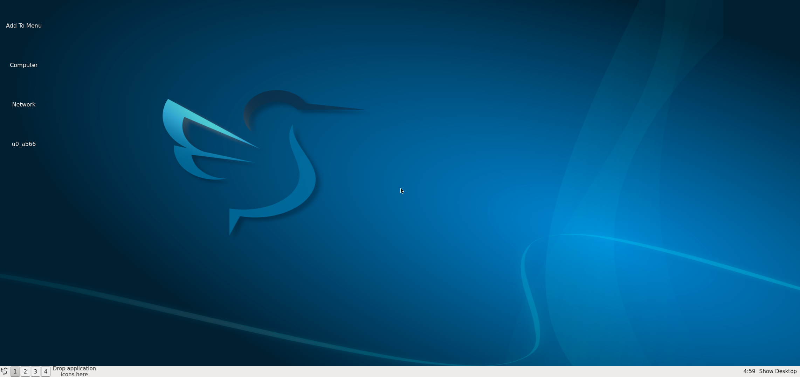
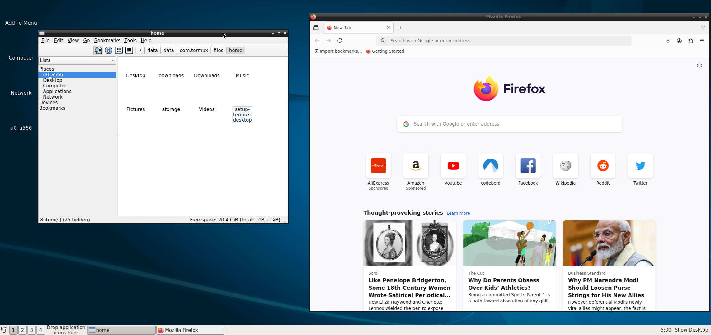
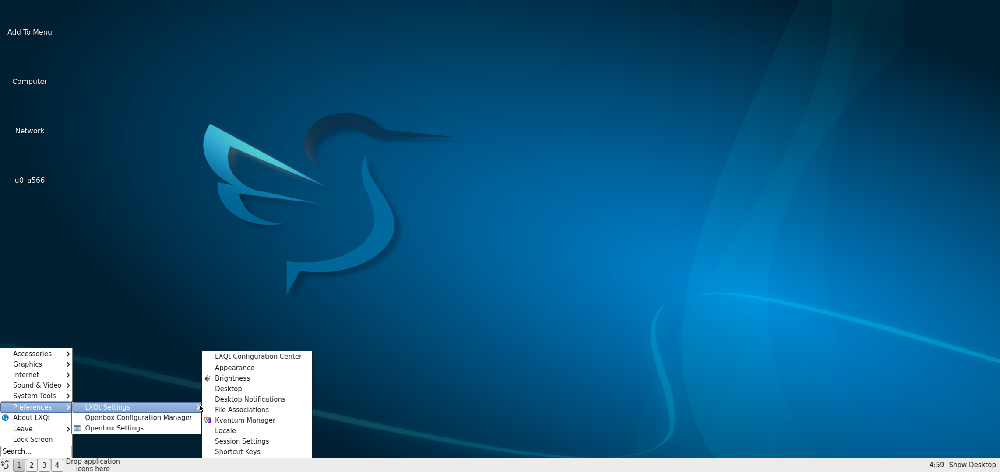
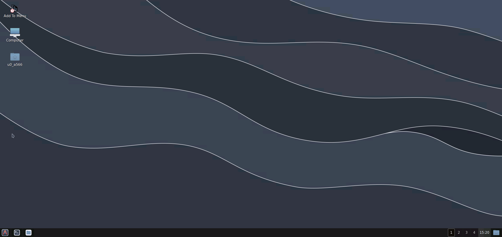
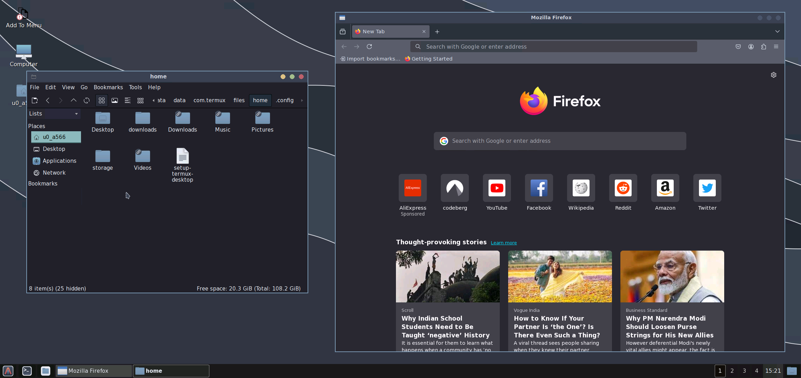
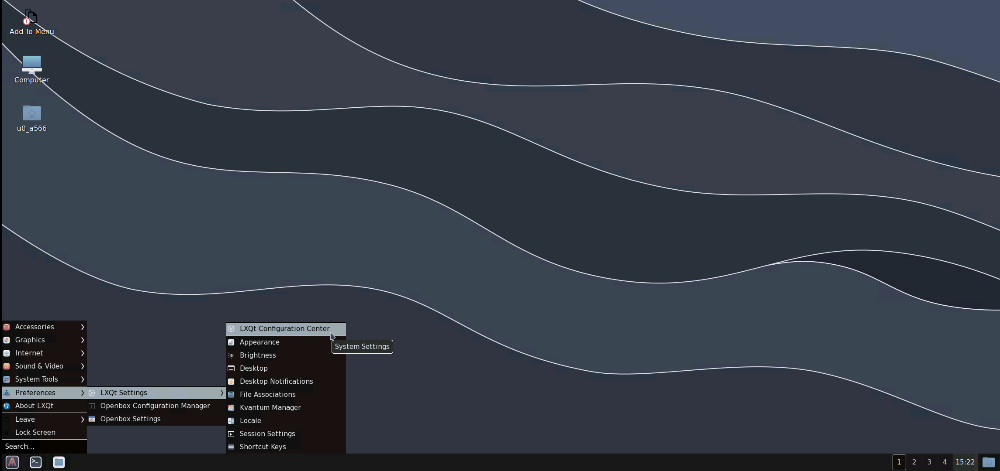

## 0. Stock :

<b style ="font-size: larger">Screenshots: </b>

|Apps|Start Menu|
|--|--|
|||

 

## 1. Nordic LXQT

<b style ="font-size: small">Style Details: 

Theme Used: 
 

- GTK Theme:- [Nordic-darker](https://www.gnome-look.org/p/1267246)
- Openbox Theme:- [Nord-Openbox](https://gitlab.com/the-zero885/nord-openbox-theme)

Icon Used:
 

- Icons:- [Nordzy](https://store.kde.org/p/1686927)
- Cursor Theme:- [Nordic-cursors](https://www.gnome-look.org/p/1662218/)

</b>

 

<b style ="font-size: larger">Screenshots: </b>

|Apps|Start Menu|
|--|--|
|||

 

# More Coming soon...