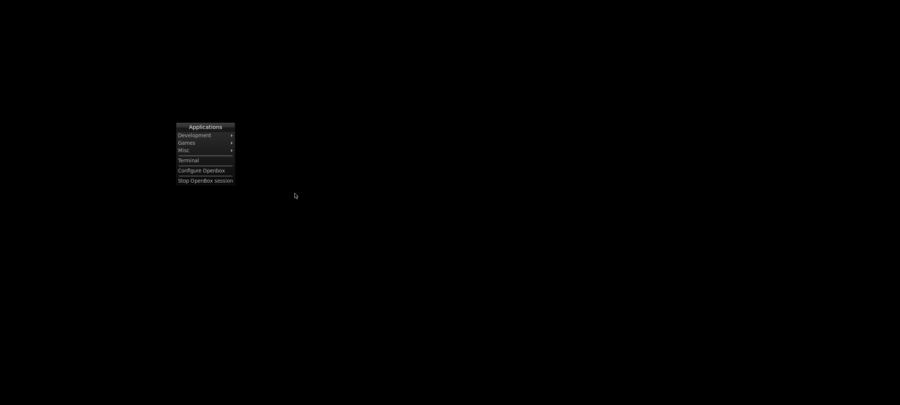
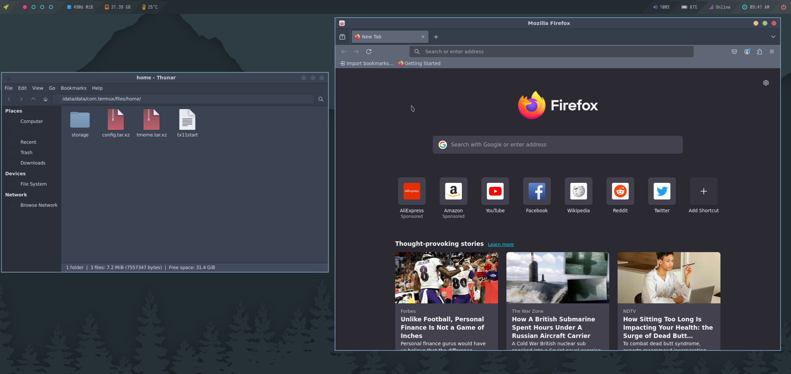
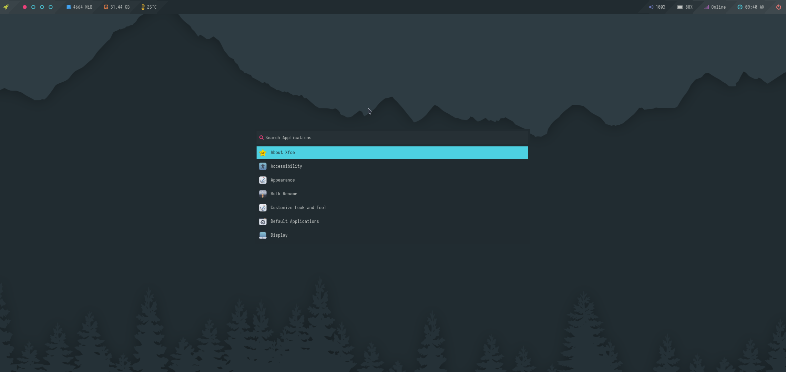
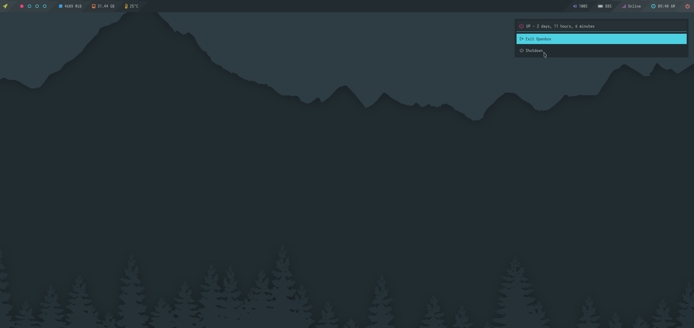

## 0. Stock :

<b style ="font-size: larger">Screenshots: </b>

|Menu|
|--|
||

 

## 1. Nordic Openbox
### Keybord shortcuts:- [Here](https://github.com/sabamdarif/termux-desktop/blob/main/see-more.md#openbox-keybindings-cheat-sheet)
>Inspired from [adi1090x termux-desktop](https://github.com/adi1090x/termux-desktop)
>my modifiacation over his style

<b style ="font-size: small">Style Details: 

Theme Used: 
 

- GTK Theme:- [Nordic-darker](https://www.gnome-look.org/p/1267246)
- Openbox Theme:- [Nord-Openbox](https://gitlab.com/the-zero885/nord-openbox-theme)
- Kvantum:- [Nord-Kvantum](https://store.kde.org/p/1533594)

Icon Used:
 

- Icons:- [Nordzy](https://store.kde.org/p/1686927)
- Cursor Theme:- [Nordic-cursors](https://www.gnome-look.org/p/1662218/)

</b>

 

<b style ="font-size: larger">Screenshots: </b>

| Apps | Dashboard |
|:--:|:--:|
|  |  |
| **Launcher** | **Powermenu**  |
|  |  

 

# More Coming soon...