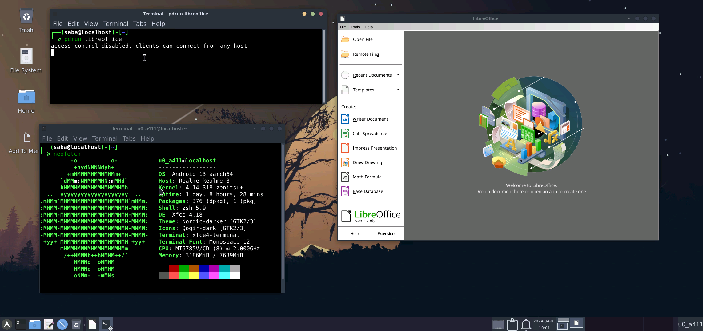
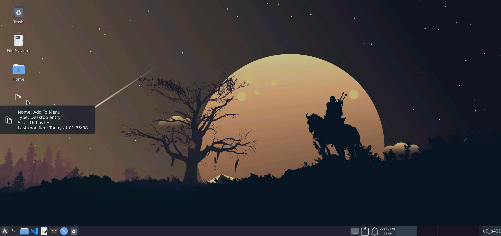
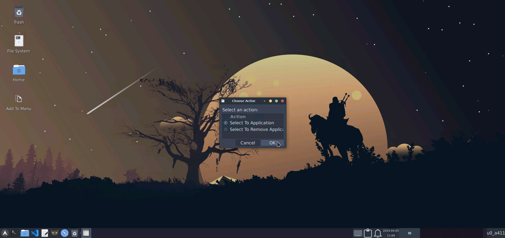
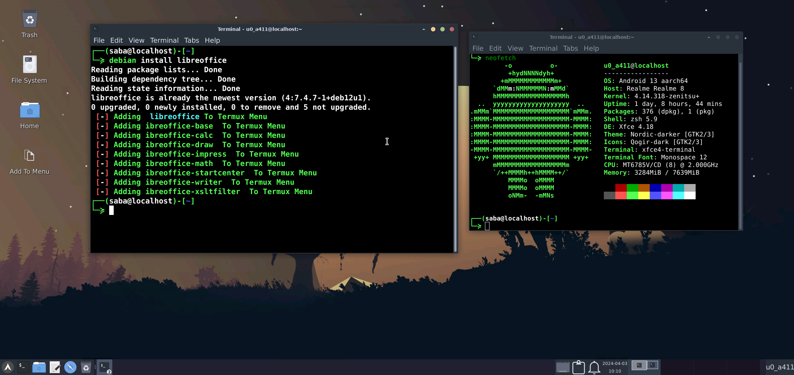

## Use Distro Container To Add More Apps In Termux:

- <b>Termux Natively Support Only Few Apps</b>
- <b>My Scripe Help You Install More Apps From Another Distro Into Termux</b>
  - <b>No Need To Login Into That Proot Distro To Use The Installed Apps</b>
  - <b>You Can See Those Apps In Termux Desktop's Apps Menu</b>
  - <b>You Can Also Launch Those Apps Directly From Termux</b>

## How To use It:

- <b>When You Run The Installer Script It Will Ask About Distro Container Setup</b>
- <b>Type `y` To Continue</b>
- <b>Then Select A Distro From The List That You Want To Use As Container</b>
- <b>Type The Corresponding Number And The Script Will Do Everything For You</b>
- <b>Then Setup A User Accound (Recomended) And Done</b>

### If You Install Any Apps In Debian And Now Want To Add And Run It From Termux :
- <b>Use `pdrun package-name`</b>

    >Like: pdrun libreoffice

    

    #### Now If You Want To Add Any App From Debian To Termux Apps Menu:
  - <b>In Terminal Type `add2menu` Then Select The App</b>

  - <b>Or You Will Find A App Call `Add To Menu` Open It And Select The App You Want To Add</b>

  - <b>Now You Find This In Your App Menu</b>

    

    

    

 

### Another Shortcut Way To Install And Add Them At Once :

- <b>Type `Distro-Name install package name` To Install And Add Them Automaticly In Termux Menu</b>
   > LIke: debian install libreoffice

   > If In Any Case This Automatic Method Don't Work Then So Add Them Manually using "Add To Menu"
   

### How To Login Into Your Installed Distro:

- <b>Type `Distro-Name` To Login Into Distro</b>

    >Like: type debian to login into debian
